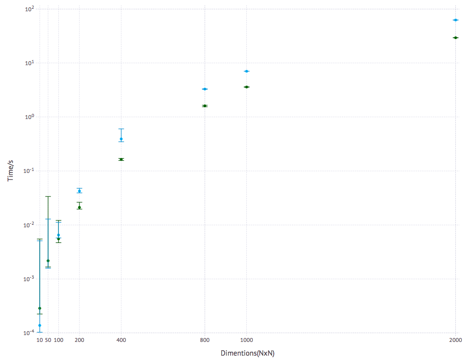
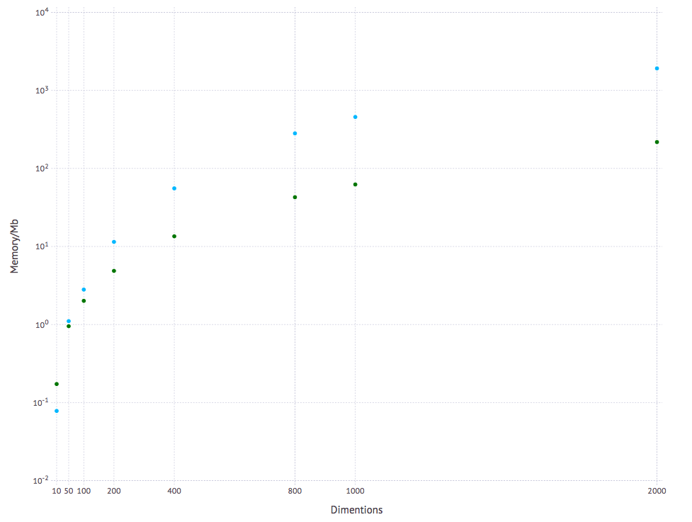

## Benchmark Results

### Benchmark Environment
```julia
julia> versioninfo()
Julia Version 0.5.0
Commit 3c9d753 (2016-09-19 18:14 UTC)
Platform Info:
  System: Darwin (x86_64-apple-darwin13.4.0)
  CPU: Intel(R) Core(TM) i5-3210M CPU @ 2.50GHz
  WORD_SIZE: 64
  BLAS: libopenblas (USE64BITINT DYNAMIC_ARCH NO_AFFINITY Sandybridge)
  LAPACK: libopenblas64_
  LIBM: libopenlibm
  LLVM: libLLVM-3.7.1 (ORCJIT, ivybridge)
```

### Table: the average elapsed time (in seconds)
| rand(n,n)  | Hungarian.jl| [Munkres.jl](https://github.com/FugroRoames/Munkres.jl) |  [Matlab(R2015b) Implementation by Yi Cao](http://cn.mathworks.com/matlabcentral/fileexchange/20652-hungarian-algorithm-for-linear-assignment-problems--v2-3-)|
|:-:|:-:|:-:|:-:|
| 10x10 | 0.00029  | **0.00015**   | 0.0035 |
| 50x50 | 0.0022  | **0.0015**  | 0.0646 |
| 100x100|**0.0055** | 0.0107   | 0.0948 |
| 200x200|**0.0211**  | 0.0433   | 0.2325 |
| 400x400|**0.1636** | 0.3793   | 0.8642|
| 800x800|**1.6093**   | 3.6520  | 4.3961 |
| 1000x1000| **3.5943**| 7.3933  | 7.3461 |
| 2000x2000| **29.3906**| 59.9122 |52.0212 |

A Matlab implementation of the algorithm is shown here as a rough baseline.

### Figure: elapsed time (smaller is better)

- Hungarian.jl : Green
- Munkres.jl   : Blue


### Figure: allocated memory (smaller is better)

- Hungarian.jl : Green
- Munkres.jl   : Blue

